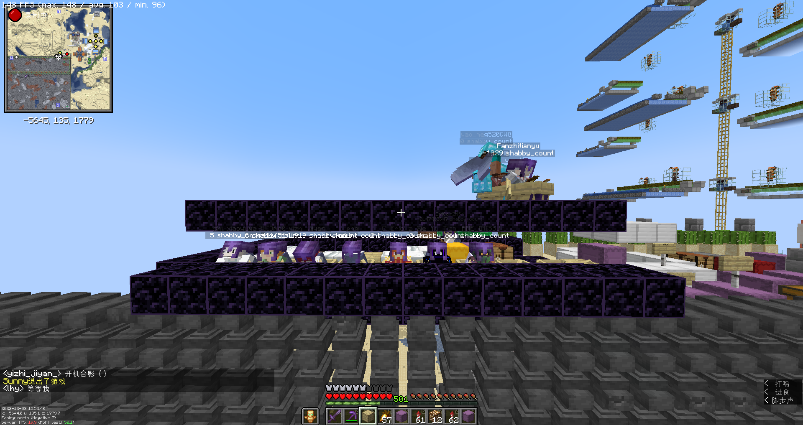
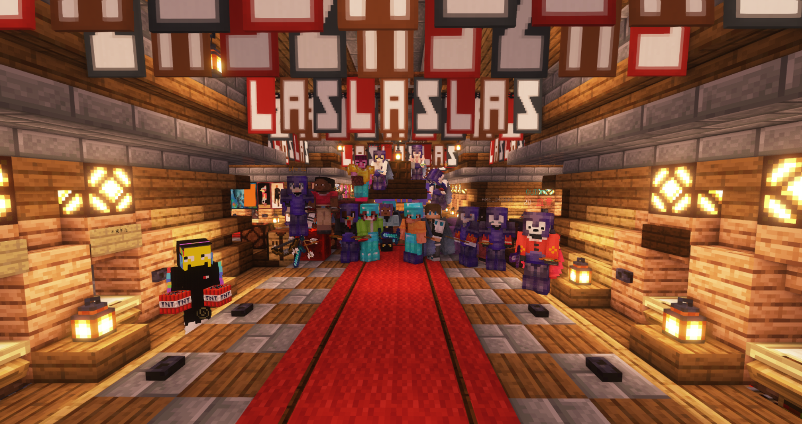
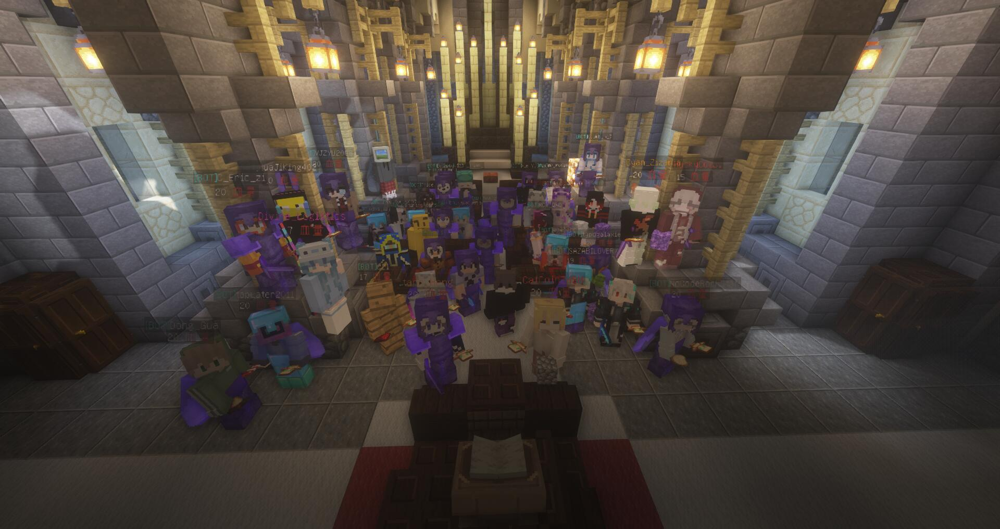

# 
**Lazy Alien Server**

>  **我们不会抛弃任何一个人，我们永远都站在一起望向远方。接下来我们依然在。**  
>  **我们的宗旨是矢志不渝，历久弥新。**  
>  **我们初心不变，我们约定永恒。**
---
>*ps:*
> 本文档由LAS成员Fanzhitianyu编写并维护。
---
> Lazy Alien Server 成立于2022.8.29  
> 由「服主」CatCoinZHSM 和「物理服主」tanh丶桁 共同建立。 
> 
> 于2023年8月14日正式与RA(Redstone_Art服[前SBT服])合并为IAC ( Infinity Art Club ) 服务器
> 
> 于2023年8月18日凌晨在原LAS部分成员的努力下，LAS复活赛胜利(部分LAS成员独立出来重建LAS服务器，并由tanh丶桁提供服务器主机)  
> 另感谢TUT服主 筱 ，愿为我们提供服务器。
>
> 2023年8月18日凌晨,经IAC管理组决定解散IAC服务器，并宣布IAC服务器合服失败。
> 
> 2023年8月18日凌晨RA服务器服主PVG_with_you注销账号，我们永远怀念PVG,以及祝愿他生活愉快。
> 
# 
**合影**

第一次炸空置域

新年合影

大概是最全的一次合影了  

LAS一周目存档最后一次合影

# 
**LAS二周目**

>   由于合并事件，让LAS成员认识的自身的不足，也让我们相互之间更加信任，凝聚力更加强。  
>   我们欢迎一周目LAS的成员，也希望我们依然站在一起，但是若是不想来，那也无妨，什么时候想回来了，我们依然欢迎。  
>   并且由于一周目不是很利于发展，所以我们觉得开启二周目，宗旨初心与一周目相同，初心不变。
---
>   并且感谢TUT服主愿意分出精力，来帮助LAS管理服务器。
---
>   LAS管理组总结一周目问题，以及本次合服事件的起因，结果，以及失败原因，最终规划了LAS未来的发展方向。
>   在未来，我们将控制与别服的交流。以及创造一个良好轻松，可以有益于机器设计，基础理论研究的氛围。
>   并且会举行小游戏，来放松玩家。
---
>   2023年8月19日，LAS与TUT联合举办筱游戏。
---
>   2023年8月18日，管理员TerryWang666离开了我们，愿他未来生活美好。  
>   感谢Terry为LAS服务器做出的贡献，我们永远铭记于心，也期待Terry未来能回来。
---
>   2023年8月21日，技术管理HuaJiKing402 因动用后台权限，给予物品，被踢出LAS服务器，虽然行为不妥，
>   但是我们依然怀念他，并且感谢他为LAS服务器做出的贡献。以及向这位老成员告别，愿我们未来依然有缘相见。
